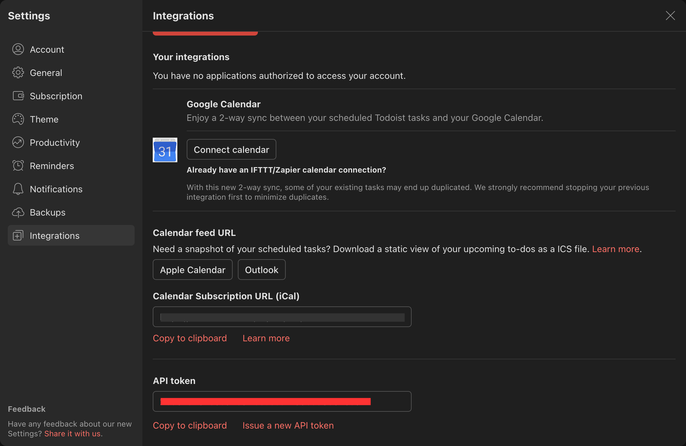

# AssignmentParser

## Introduction

AssignmentParser is a program that takes in a list and automates the process of adding them as a task in a [Todoist](https://todoist.com) account.

Built with [Python](https://python.org), [Requests](https://docs.python-requests.org), and the [Todoist API](https://developer.todoist.com) this program was made to address a minor inconvenience I had. To understand the context that led to the creation of this project, take a look at [CONTEXT.md](https://github.com/arashnrim/AssignmentParser/blob/main/CONTEXT.md).

## Getting started

This section presumes that you already have a recent version of [Python](https://python.org) installed. The program was developed with Python 3.6.8, and tested on GitHub Actions with Python 3.6, 3.7, 3.8, and 3.9. If you have a version preceding 3.6, it is not known if it may work.

To get started, clone the repository by using `git clone`.

```
git clone https://github.com/arashnrim/AssignmentParser.git
```

Afterwards, navigate into AssignmentParser folder using `cd`.

```
cd AssignmentParser/
```

Next, install the required modules using `pip`.

```
pip install -r requirements.txt
```

Afterwards, you will need to retrieve the API key for your Todoist account. Navigate to Todoist settings, then the Integrations tab. Copy your API token.



Create a new file called `.env` and include the following inside it; replace `<token>` with your Todoist token:

```
TODOIST_KEY="<token>"
```

Once done, you should be able to use AssignmentParser.

```
python main.py -h
```

## Contributing

Since this project is mostly a personal project, it is unlikely that external assistance is required for this project. Either way, though, if you would like to offer some assistance — offering tips, for example — the Issues page is always open.